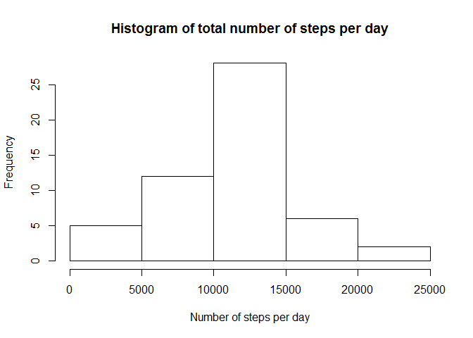

# RepData_PeerAssessment1
##Loading and preprocessing the data

```r
library(data.table)
library(dplyr)
```

```r
activity<-read.csv("activity.csv")
activity<-tbl_df(activity)
sumstep<-activity %>%
        filter(!is.na(steps)) %>%
        group_by(date) %>%
        summarize(steps=sum(steps))
```

##What is mean total number of steps taken per day?
* Histogram of total number of steps per day


```r
hist(sumstep$steps, main="Histogram of total number of steps per day",
     xlab="Number of steps per day")
```

<!-- -->

* Mean and meadian of total number of steps per day


```r
mean(sumstep$steps)
```

```
## [1] 10766.19
```

```r
median(sumstep$steps)
```

```
## [1] 10765
```
* The mean of total steps taken per day 1.0766189\times 10^{4} steps.

* The median of total steps taken per day 10765 steps.

##What is the average daily activity pattern?


```r
avstep<-activity %>%
        filter(!is.na(steps)) %>%
        group_by(interval) %>%
        summarize(steps=mean(steps))
with(avstep, plot(interval, steps, main="Average number of steps per interval",
                  xlab="Interval", ylab="Steps", type="l"))
```

<!-- -->


*The maximum number of steps contained in 835 interval.


```r
maxstep<-avstep %>% filter(steps>=max(avstep$steps))
maxstep$interval
```

```
## [1] 835
```

##Imputing missing values

* Total number of missing values in dataset is 2304


```r
 sum(is.na(activity$steps))
```

```
## [1] 2304
```

* Replacing missing value with mean for 5 minute interval


```r
activityNew<-activity
for(i in 1:nrow(activity)) {
   if (is.na(activity$steps[i])){
      activityNew$steps[i]=mean(filter(activity, interval==activity$interval[i],
                                       !is.na(steps))$steps)
   }
  
}
sumstepNew<-activityNew %>%
        filter(!is.na(steps)) %>%
        group_by(date) %>%
        summarize(steps=sum(steps))
```

* Updated histogram with imputed NA's


```r
hist(sumstepNew$steps, main="Histogram of total number of steps per day",
     xlab="Number of steps per day")
```

<!-- -->

* Updated mean and meadian of total number of steps per day


```r
mean(sumstepNew$steps)
```

```
## [1] 10766.19
```

```r
median(sumstepNew$steps)
```

```
## [1] 10766.19
```
* The mean of total steps taken per day 1.0766189\times 10^{4} steps.

* The median of total steps taken per day 1.0766189\times 10^{4} steps.

*The new mean is same as the old one

*The new median is higher the old one.

##Are there differences in activity patterns between weekdays and weekends?

* Added additional variable weekday


```r
weekstep<-activityNew %>% 
  mutate(weekday=if_else(wday(date)>1 & wday(date)<7, "weekday", "weekend")) %>%
  group_by(weekday, interval) %>%
  summarize(steps=mean(steps))
```

* Graph of average steps per interval on weekends and weekdays


```r
par(mfrow=c(1,2))
with(subset(weekstep, weekday=="weekday"), plot(interval, steps, type="l", main="Weekdays", xlab="Intevals", ylab="Steps"))
with(subset(weekstep, weekday=="weekend"), plot(interval, steps, type="l", main="Weekends", xlab="Intevals", ylab="Steps"))
```

<!-- -->
